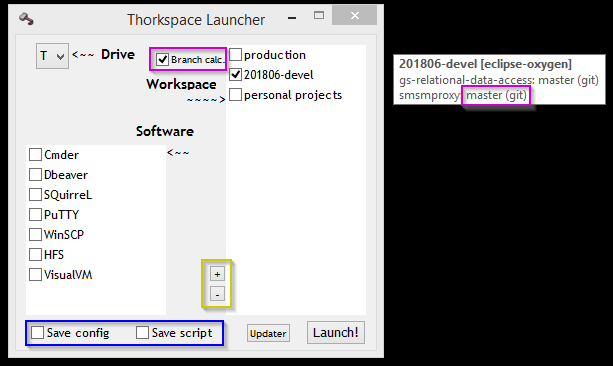

# Thorkspace
> Java development environment for MS Windows focused on portability and zero requirements on user's PC.

This is a set of MS Windows CMD and AutoIT scripts that work together to offer a portable Java development environment.\
These scripts rely on a repository (initially hosted on [pkg.argallar.net](https://pkg.argallar.net/artifactory/thorkspace)) which contains different software utilities, the user can download and deploy to work with.

- [Why?](#why?)
- [Installation](#installation)
- [Usage examples](#usage-examples)
  * [Managing workspaces](#managing-workspaces)
  * [Changing default launcher's behaviour](#changing-default-launcher's-behaviour)
  * [LAN Contagion!](#lan-contagion!))
  * [Editing `packages.cfg`](#editing-`packages.cfg`)
  * [Updating Thorkspace](#updating-thorkspace)
- [Release history](#release-history)
- [Contributing](#contributing)

## Why?
Fair question... short answer: because I enjoy messing with stupid things (madness?).\
Long answer: I have worked on several Java development teams (most of them using Eclipse as IDE) where development environments caused a lot of pain. Having a new team member since Monday and not being able to import the projects and run the application normally on his/her PC till Tuesday was really common... Even worse: version changes on IDE or any other development tools in a 8-people team almost always became a waste of time due to things such different antivirus software, OS versions, misunderstandings on the process, etc.\
Thorkspace tries to solve all these problems:
1. Same software and configuration for all team members. Including Java version, that does not need to be installed in the PC.
2. Same enviroment context for all software. Including %HOME%, that will be `data` folder inside Thorkspace... so making it independent from your user data.
3. Every IDE workspace will have the same starting configuration (packed inside IDE's package). This should end eternal problems as Eclipse save actions differences between team members.
4. All files are packed together in a self-contained environment: it mounts a virtual drive, so all paths are relative to it. You can put Thorkspace on a USB drive and run it on any PC with no more requirements than enough CPU/RAM to run your IDE.
5. Environment scripts are online and software packages execute their own scripts when *installed*. So you can modify the environment; test it; and ask the team members to update using GIT (scripts) or TSSelector window (software)... they won't need to configure anything directly.
Of course it is not perfect (yet), the TODO list is endless and probably it contains mistakes... but these are my 2cents on this matter.

## Installation

* Clone this repository.
```
git clone https://github.com/dpradom/thorkspace
```
* Optional: *Edit `conf/packages.cfg` to point a different server `url` or even `server` type (see [configuration](## Configuration) for more details).*
* Run `launch.bat` for the first time. It will start downloading the minimun packages to execute the application.
* Check the packages you want and click `Install` (be patient).


## Usage examples

Once it is *installed* (minimun and selected packages are downloaded and deployed) all you need to do is execute `launch.bat`.\
Doing this you will be able to check the application(s) and workspace(s) you want to start (see [managing workspaces](#Managing workspaces) for more details). 


Clicking "Launch", all of them will be started (also all config changes you made -read below- will be saved to disk).\
You can also click on "Updater" to *install* new packages from repository anytime.

### Managing workspaces

Eventually, you'll want to add a new Workspace to your environment. You can do that by clicking on the `+` button on the left of "Workspace" box. This will open a dialog box in which you'll be asked for a name and an IDE (note you need to install at least one package from "IDE" group before).


If anytime you want to remove a workspace, all you have to do is select it and click the `-` button. Contents won't be deleted from your disk, Thorkspace will just ignore them.

### Changing default launcher's behaviour

There are various checks you can use to change your Thorkspace behaviour. Remember that anything you change will be saved to disk once you click "Launch" and will take effect next time you execute `launch.bat`.



* `Save config`: will save check programs/workspaces state as default.
* `Save script`: will create a `start.bat` script on root folder that will let user to launch checked programs/workspaces without opening Thorkspace UI.
* `Branch calc`: will show project's version control information on workspace's tooltip window.

### LAN Contagion!

Maybe you noticed about the check on the bottom-left corner of Selector window...


It will transform your Thorkspace copy on a package repository. To achieve that, it will start downloading the whole list of packages from current repository (be patient!). Once done, Launcher's "Launch" will start a [HFS instance](http://www.rejetto.com/hfs/) exposing an URL others can configure as their repository URL (see [editing `packages.cfg`](#Editing `packages.cfg`) for details).

### Editing `packages.cfg`

This file (located in `conf` folder), contains repository information (and is written using .properties syntax). You can edit it at will.\
Properties are quite self-explanatory and give you 3 types onf repository to configure (depending on its location): `artifactory` (default), `lan-repo` (you have spotted someone with "LAN Contagion" check on...), `local` (you already have all packages downloaded on a local folder).

### Updating Thorkspace

When Selector detects the existance of a new Thorkspace's version, it will warn the user and offer a button to update.


"Minor" version change means light differences on scripts, while "Major" means even the package *ecosystem* has changed.

## Release History

* 20180425.3
    * Work in progress
* 20180425.2
    * Fixed several issues
* 20180425.0
    * Initial version.

## Contributing
1. Fork it.
2. Create your feature branch (`git checkout -b feature/fooBar`).
3. Commit your changes (`git commit -am 'Add some fooBar'`).
4. Push to the branch (`git push origin feature/fooBar`).
5. Create a new Pull Request.

## Meta
Daniel Prado – dpradom@argallar.com

Distributed under the GPLv3 license. See ``LICENSE`` for more information.


